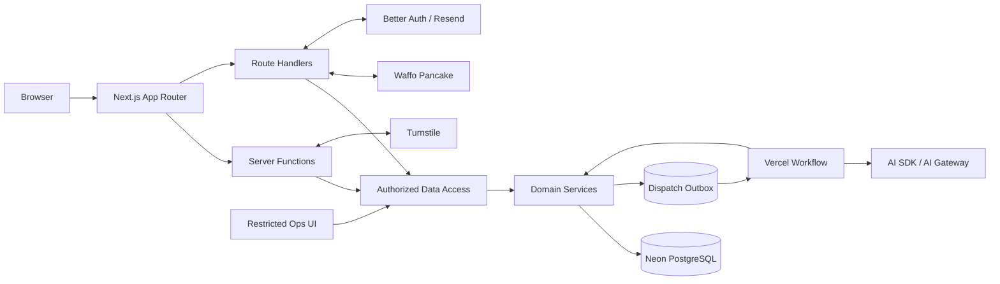
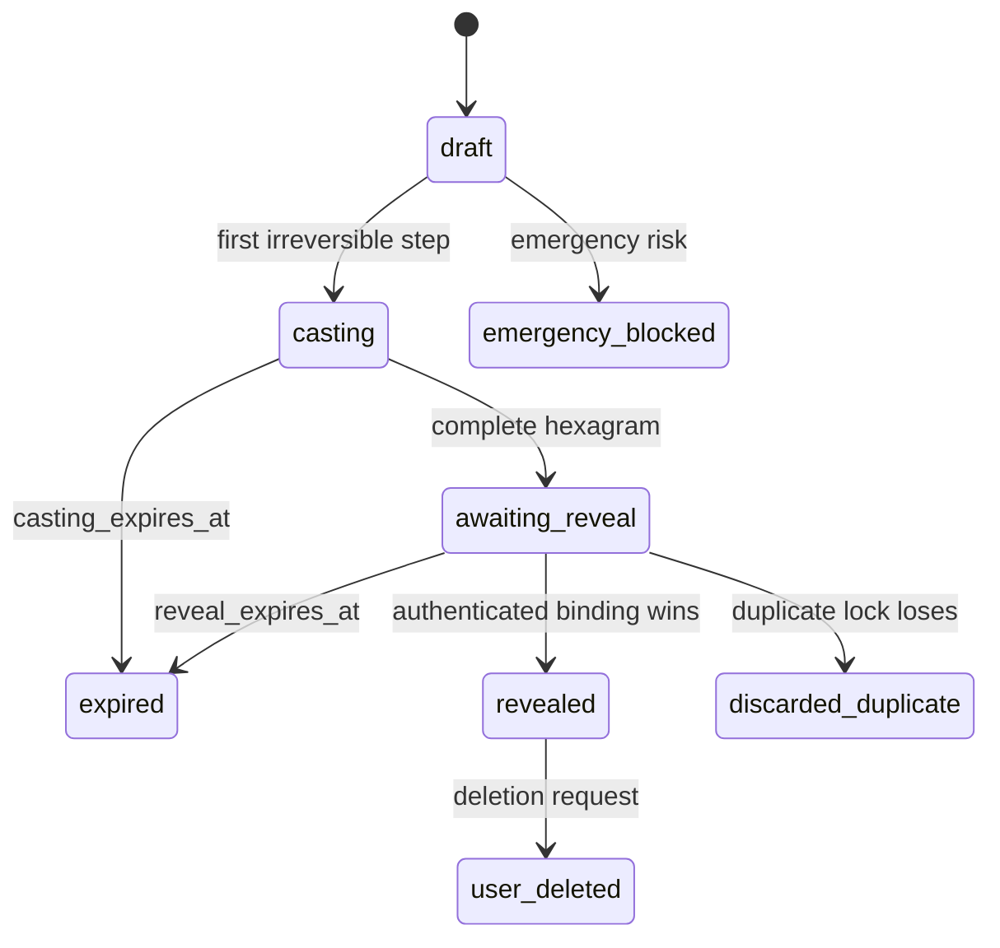
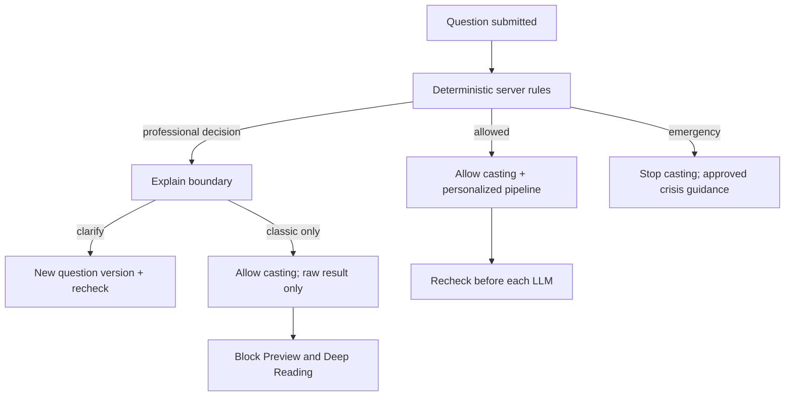

# 《I Ching》多玩法 MVP 技术设计文档

**版本：** V2.1 合并定稿版  
**日期：** 2026-07-29  
**对应产品文档：** `PRD.md` V2.1  
**目标市场：** 美国  
**部署形态：** 单体 Next.js Web 应用  
**文档状态：** 架构已收口；完成第 3.2 节 D0 门禁后进入业务编码  
**规范优先级：** PRD > 本文档

> 本文档实现“三硬币为主入口，蓍草与梅花当前时间起卦为首发次级玩法”的完整 MVP。  
> 研发阶段可以按三硬币优先推进，公开发布时三种玩法必须全部可用。  
> 文档不以框架偏好代替业务正确性；所有关键约束都必须能由数据库、测试或运行时观测验证。

---

# 1. 目标与非目标

## 1.1 技术目标

系统必须可靠完成：

```text
SEO / 方法页
→ 结构化问题与服务端风险预检
→ 三种不可逆起卦仪式之一
→ 登录意图验证与匿名结果绑定
→ 跨玩法 72 小时同题串行检查
→ 原始结果与固定 Preview
→ Checkout / 通用权益
→ 可恢复的后台报告生成
→ 校验、保存、消费权益
→ 历史、复核、退款与数据删除
```

优先保证：

1. 起卦算法正确、可版本化、可审计；
2. 已保存结果在刷新、重试和并发下不改变；
3. 起卦、风险、AI、权益和复核使用正交状态；
4. 72 小时锁定、支付和权益具备数据库级并发保护；
5. Workflow 超时、重放和迟到完成不会重复保存或扣费；
6. 高风险问题在所有 LLM 入口前由服务端阻断；
7. 用户问题按敏感数据加密、最小化、审计和清理；
8. 所有失败均有明确状态、日志、指标和用户提示。

## 1.2 非目标

- 微服务、Kafka、Kubernetes 或自建分布式队列；
- 通用插件系统、规则 DSL 或 Repository 抽象层；
- WebSocket、SSE 或逐字流式报告；
- 向量数据库和语义重复问题识别；
- 完整六爻、每日一卜、订阅和长期复盘；
- 允许模型调用任意工具或任意网络地址；
- 为未确认的未来玩法提前建立复杂继承体系。

---

# 2. 需求追踪与架构原则

## 2.1 追踪规则

- 代码测试名称、验收清单和监控面板必须引用 PRD 需求 ID；
- 每次改变产品状态、金额、算法或安全规则时必须同步更新本文档；
- `docs` 只维护 PRD 与本文档两份规范，产品规则变更必须同步更新二者；
- 未在 PRD 或本文档定义的行为不得由前端临时决定。

## 2.2 设计原则

### 数据库是真相，但不是唯一执行器

- PostgreSQL 是用户可见业务状态的唯一事实来源；
- Workflow 负责执行与重试，不能绕过数据库终态；
- 支付回跳、浏览器状态和前端动画都不是事实来源。

### 明确优于聪明

- 领域函数与数据库约束优先；
- 只为真实外部不确定性保留薄适配边界；
- 不用类层级包装简单函数；
- 不用“最多 200 行”作为质量替代指标；文件超过约 250 行时检查职责、依赖和测试难度，但不机械拆分。

### 幂等优于补救

- 所有关键写请求带稳定幂等键；
- 数据库唯一约束是最终防线；
- 重试返回原业务对象，不重新抽签、发权益或创建报告。

### 失败可见、恢复有界

- 只重试明确的瞬时错误；
- 业务拒绝不重试；
- 超时后旧执行必须失去写入资格；
- 未知异常记录完整上下文后上抛，不吞错、不返回假成功。

---

# 3. 开工门禁与决策状态

## 3.1 决策分类

| 状态 | 含义 |
| --- | --- |
| Confirmed | 可以直接实现，改变时需写架构决策记录 |
| Provisional | 方向可用于技术验证，未通过门禁不能进入生产 |
| Blocked | 前置内容或外部审批未完成，禁止开始依赖它的生产编码 |

## 3.2 D0 领域与外部门禁

| 项目 | 状态 | 进入业务编码的完成条件 |
| --- | --- | --- |
| 单体 Next.js + PostgreSQL | Confirmed | 建立最小可部署骨架和集成测试数据库 |
| 64 卦映射 | Blocked | 双人审校金标准、版本、哈希和 64/64 自动校验 |
| 英文经典文本 | Blocked | 来源、许可、署名、版本和撤换方案获批准 |
| 三硬币映射 | Blocked | 明确 head/yang=3、tail/yin=2 并由领域顾问签字 |
| 蓍草算法 | Blocked | 步骤、概率和金标准样例获领域顾问批准 |
| 梅花算法 | Blocked | 历法、闰月、子时、时区、体用规则获批准 |
| 报告解释规则 | Blocked | 特殊卦象和三种方法的英文金标准获批准 |
| Waffo Pancake | Provisional | 商户、产品、Test/Production Webhook 与退款政策审核通过；自动拒付同步等待官方机器接口 |
| Vercel Workflow | Provisional | 完成重试、超时、部署恢复和本地测试 spike |
| 美国法律与隐私 | Blocked | 条款、隐私、退款、权益到期和紧急提示获专业审核 |

算法、内容和安全门禁可以与基础骨架并行，但依赖它们的生产功能不得用临时数据冒充完成。

---

# 4. 技术栈

## 4.1 应用与数据

| 类别 | 选择 | 状态 | 说明 |
| --- | --- | --- | --- |
| Web | Next.js App Router | Confirmed | Server Component、Server Function、Route Handler、SEO |
| 语言 | TypeScript strict | Confirmed | 禁止隐式 `any`，领域枚举使用受控联合类型 |
| UI | React + Tailwind CSS | Confirmed | 首发不引入大型组件框架 |
| 校验 | Zod | Confirmed | 网络边界、环境变量和 AI 输出统一校验 |
| 数据库 | Neon PostgreSQL | Confirmed | 事务、约束、JSONB、分支数据库和恢复能力 |
| ORM | Drizzle ORM | Confirmed | Schema 明确，复杂并发允许使用参数化 SQL |
| 鉴权 | Better Auth | Provisional | Google OAuth、Magic Link；先验证登录意图与回调行为 |
| 邮件 | Resend | Provisional | Magic Link 和交易通知；上线前验证 SPF/DKIM/DMARC |
| Bot 防护 | Cloudflare Turnstile | Provisional | 服务端 Siteverify，仅用于高风险动作 |

## 4.2 AI、任务与支付

| 类别 | 选择 | 状态 | 说明 |
| --- | --- | --- | --- |
| AI | AI SDK v6 + AI Gateway | Provisional | `generateText` + `Output.object`，以锁文件中的已测版本为准 |
| 后台任务 | Vercel Workflow DevKit | Provisional | Preview 与 Deep Reading 的可恢复执行 |
| 支付 | Waffo Pancake | Provisional | Checkout、SDK 验签 Webhook、退款；拒付自动同步为 blocked_external |
| 客户端轮询 | SWR | Confirmed | 只读任务状态，指数退避并在终态停止 |

依赖版本不在架构文档硬编码“最新”。实现时固定精确版本和锁文件，并在升级前运行完整回归。

## 4.3 允许的薄适配边界

只保留两类外部适配，不建立通用插件系统：

```ts
type PaymentProvider = {
  createCheckout(input: CheckoutInput): Promise<CheckoutReference>;
  verifyAndParseWebhook(rawBody: string, headers: Headers): Promise<PaymentEvent>;
};

type GenerationRunner = {
  enqueue(jobId: string, generationEpoch: number): Promise<ExternalRunReference>;
};
```

目的分别是支付商审批不确定性和后台任务启动可靠性；领域逻辑、账本和报告 Schema 不进入适配器。

## 4.4 工程规范

- 包管理统一使用 `pnpm`，ESM `import` / `export`；
- 默认使用原生 `fetch`，只有统一重试或签名 SDK 能显著降低错误时才引入依赖；
- 默认 Server Component；Client Component 只处理交互、动画、本地 UI 状态、浏览器时区和 SWR；
- Server Functions 和 Route Handlers 都视为公开网络端点，逐次认证、授权和校验；
- Prompt 放入 `src/prompts/`，版本不可覆盖；
- 禁止空 `catch`、仅日志后吞错、Mock 报告和未知状态兜底；
- 依赖、环境变量和数据库迁移变更必须进入评审说明；
- 未完成工作进入带上下文和负责人的任务系统，不在生产代码留下无归属占位注释。

---

# 5. 总体架构



## 5.1 边界

- 页面读取：Server Component → 授权 DAL → DB；
- 用户变更：表单／Client Component → Server Function → Domain → DB；
- 外部回调：Route Handler → 原始载荷验签 → 事件 Inbox → Domain → DB；
- 长任务：事务创建 Job + Outbox → Dispatcher → Workflow → 受 fencing 保护的完成事务；
- 运营复核：独立角色授权、按案件解密、全量审计；
- 前端永远不直接连接数据库、AI、支付或密钥服务。

## 5.2 目录

```text
src/
├── app/
│   ├── (marketing)/
│   ├── (product)/
│   ├── (ops)/
│   └── api/
├── actions/
├── components/
├── domain/
│   ├── casting/
│   │   ├── three-coin/
│   │   ├── yarrow/
│   │   ├── mei-hua/
│   │   └── hexagrams/
│   ├── questions/
│   ├── risk/
│   ├── previews/
│   ├── readings/
│   ├── entitlements/
│   ├── payments/
│   ├── quality-reviews/
│   └── privacy/
├── db/
│   ├── schema/
│   ├── queries/
│   ├── transactions/
│   └── migrations/
├── prompts/
├── schemas/
├── workflows/
├── adapters/
│   ├── payments/
│   └── generation/
├── lib/
│   ├── auth/
│   ├── crypto/
│   ├── logging/
│   └── turnstile/
└── config/
```

目录名必须表达领域或基础能力；禁止无边界的 `utils/`、`helpers/`、`common/` 和 `misc/`。

---

# 6. 核心领域类型

## 6.1 起卦方法与爻值

```ts
type CastingMethod =
  | 'three_coin'
  | 'yarrow_stalk'
  | 'mei_hua_current_time';

type LineValue = 6 | 7 | 8 | 9;
```

| 值 | 原卦 | 动爻 | 变卦 |
| ---: | --- | --- | --- |
| 6 老阴 | 阴 | 是 | 阳 |
| 7 少阳 | 阳 | 否 | 阳 |
| 8 少阴 | 阴 | 否 | 阴 |
| 9 老阳 | 阳 | 是 | 阴 |

六爻始终从下向上保存：索引 `0` 是初爻，索引 `5` 是上爻。所有数据库、算法、API 和 UI 使用同一顺序。

## 6.2 统一结果

```ts
type HexagramResult = {
  lineValuesBottomUp: readonly [
    LineValue, LineValue, LineValue,
    LineValue, LineValue, LineValue,
  ];
  primaryHexagramNumber: number;
  movingLinePositions: readonly number[]; // 1..6
  relatingHexagramNumber: number | null;
  method: CastingMethod;
  algorithmVersion: string;
  classicMappingVersion: string;
};
```

- 无动爻时 `relatingHexagramNumber = null`；
- 梅花当前时间起卦必须把上下卦的静态阴阳转为 7／8，并把唯一动爻转为 9／6，不能只返回两个卦名；
- `movingLinePositions` 升序且不重复；
- 结果 HMAC 覆盖所有不可变字段，用于审计，不作为用户身份验证。

## 6.3 正交状态

```ts
type CastingLifecycle =
  | 'draft'
  | 'casting'
  | 'awaiting_reveal'
  | 'revealed'
  | 'expired'
  | 'discarded_duplicate'
  | 'emergency_blocked'
  | 'user_deleted';

type RiskStatus =
  | 'not_checked'
  | 'allowed'
  | 'professional_decision_blocked'
  | 'needs_clarification'
  | 'emergency_blocked';

type PreviewStatus = 'not_started' | 'queued' | 'generating' | 'completed' | 'failed' | 'blocked';
type ReadingStatus = 'not_started' | 'reserved' | 'queued' | 'generating' | 'validating' | 'completed' | 'failed' | 'blocked';
type ReservationStatus = 'reserved' | 'consumed' | 'released' | 'expired';
type QualityReviewStatus = 'not_started' | 'submitted' | 'supplementing' | 'in_review' | 'approved' | 'rejected';
```

不得使用一个 `status` 同时表达多条状态机。

---

# 7. 状态机与核心不变量

## 7.1 起卦状态机



允许迁移使用显式表驱动函数；未知或逆向迁移立即失败。

## 7.2 数据库必须保证的不变量

- 每个会话每个方法步骤只有一条不可变有效记录；
- 每个会话最多一个 `cast_result`；
- 同一账号最多一场 `casting`／`awaiting_reveal`；
- 同一匿名浏览器最多一场 `casting`／`awaiting_reveal`；
- 同一用户＋问题指纹在锁定窗口内最多一个获胜结果；
- 每个会话最多一份成功 Preview 和一份成功 Deep Reading；
- 每个 Reading 同时最多一个活动 Reservation；
- 每个支付事件只处理一次；
- 权益计数非负且批次恒等式成立；
- 已终止 `generation_epoch` 不能完成写入；
- 任何 Route Handler 读取资源前验证所有权或运营角色。

## 7.3 两个到期时间

- 第一不可逆步骤写入时设置 `casting_expires_at = now + 24h`；
- 完整结果原子保存时设置 `reveal_expires_at = now + 24h`；
- 完整结果产生后不再使用 `casting_expires_at` 判断揭示；
- 所有比较使用数据库 `now()`，不信任客户端时钟；
- 定时清理只改变状态，不能物理删除仍在争议或审计期的数据。

---

# 8. 起卦算法

## 8.1 公共要求

- 仅在 Node.js 服务端执行；
- 随机玩法使用 `node:crypto`，禁止 `Math.random()`；
- 随机调用、原始步骤、算法版本和完成时间可审计；
- 64 卦映射来自经审校静态表，不从序号规律猜测；
- 算法函数是无 IO 纯函数，事务函数负责随机源和持久化；
- 同一幂等键已有步骤时直接返回原记录，不再次读取随机源；
- 历史结果永不因算法升级重算。

## 8.2 三硬币 v1

```ts
type ThreeCoinStep = {
  lineIndex: 0 | 1 | 2 | 3 | 4 | 5;
  coinFaces: readonly ['yin' | 'yang', 'yin' | 'yang', 'yin' | 'yang'];
  lineValue: LineValue;
  generatedAt: string;
  algorithmVersion: 'three-coin-v1';
};
```

事务流程：

1. 锁定会话并校验状态、所有权、到期和期望 `lineIndex`；
2. 查询该行是否存在，存在则返回；
3. 使用独立随机位生成三枚面；
4. `yang=3`、`yin=2` 求和；
5. 插入步骤；
6. 第六爻完成时原子生成并插入 `cast_result`；
7. 提交后才返回给动画。

唯一约束：`UNIQUE(casting_session_id, line_index, step_kind)`。

## 8.3 蓍草 v1

在 D0 批准后固定以下接口，批准前不假定概率细节：

```ts
type YarrowChange = {
  lineIndex: 0 | 1 | 2 | 3 | 4 | 5;
  changeIndex: 0 | 1 | 2;
  startingStalks: number;
  leftGroup: number;
  rightGroup: number;
  removedFromRight: 1;
  leftRemainder: 1 | 2 | 3 | 4;
  rightRemainder: 1 | 2 | 3 | 4;
  endingStalks: number;
  algorithmVersion: string;
};
```

每次变化必须验证数量守恒。三变后才写该爻的 6／7／8／9；六爻完成后生成统一结果。

唯一约束：`UNIQUE(casting_session_id, line_index, change_index)`。

测试包括：

- D0 金标准逐步样例；
- 所有中间数量不变量；
- 固定伪随机源的确定性回放；
- 大样本分布与已批准理论概率的统计检验；
- 统计失败不得通过放宽容差掩盖。

## 8.4 梅花当前时间 v1

输入：

- 服务端 UTC 时间；
- 用户在第一步前确认的有效 IANA 时区；
- 经批准历法库产生的本地历法字段；
- 算法和历法库版本。

要求：

- 客户端只能提交 IANA 时区字符串，不能提交时间戳；
- 服务端重新验证时区并计算当地时间；
- 闰月、夏令时重叠／跳时、子时换日全部进入金标准；
- 算法余数、八卦序数和动爻规则由 D0 版本文件定义；
- 确认后时区和所有计算输入锁定；
- 同一幂等键返回同一结果，不因跨分钟或跨日重算。

---

# 9. 匿名会话与登录绑定

## 9.1 匿名 Cookie

`anonymous_casting_session`：

- 至少 256 位随机熵；
- HttpOnly、Secure、SameSite=Lax；
- 限定 Path 和合理 Max-Age；
- 数据库只保存带版本的 HMAC，不保存原值；
- 登录绑定或匿名结果过期后轮换；
- 前端 JavaScript 不可读取。

## 9.2 Login Intent

`login_intents` 保存：

```text
id
casting_session_id
anonymous_session_hash
nonce_hash
allowed_callback_path
expires_at
consumed_at nullable
created_at
```

约束：

- 短期有效、单次消费；
- 回调只接受站内白名单路径；
- OAuth state 和 Magic Link metadata 关联 intent；
- 回调浏览器必须获得自己的认证 Session；
- 原匿名浏览器不能因为其他浏览器完成登录而自动获得报告权限；
- Magic Link Token 使用框架支持的哈希存储和原子单次消费。

## 9.3 绑定事务

```text
verify authenticated session + login_intent
→ lock anonymous casting row
→ validate owner hash, expiry, lifecycle
→ normalize + HMAC question
→ acquire per-user/per-question lock
→ duplicate? mark discarded and return original id
→ otherwise bind user, mark revealed, commit
→ only after commit return reveal authorization
```

授权返回只包含当前用户可读的 ID，不返回未获胜新卦的字段。

---

# 10. 72 小时同题锁定

## 10.1 规范化与指纹

规范化：

1. 场景和目标使用稳定枚举；
2. context 执行 Unicode NFKC、转小写、首尾去空格；
3. 连续空白折叠；
4. 移除批准列表内的非语义标点；
5. 使用带版本 HMAC：`HMAC-SHA256(keyVersion, normalizedQuestion)`。

不保存裸 SHA-256，防止低熵问题被离线猜测。问题锁写入密钥不能在一个 72 小时窗口内直接切换：先让全部应用实例加载新旧密钥，继续使用旧键写满 72 小时，确认旧窗口全部过期后再原子切换写入版本。查询在过渡期计算全部允许版本，避免同一问题因密钥轮换形成两把锁。

## 10.2 串行化方案

新增 `question_locks`：

```text
user_id
question_fingerprint
fingerprint_key_version
winning_casting_id
locked_until
created_at
updated_at
PRIMARY KEY(user_id, question_fingerprint, fingerprint_key_version)
```

绑定或已登录创建时：

1. 在事务内按稳定键获取 `pg_advisory_xact_lock`，或插入／锁定对应 `question_locks` 行；
2. 行不存在则创建；
3. `locked_until > now()` 则返回获胜记录；
4. 已过期则原子替换获胜记录和新窗口；
5. 同一事务更新 casting lifecycle；
6. 并发事务只能一个成功。

不得仅执行“SELECT 没有重复 → INSERT”，因为默认隔离级别下会产生竞态。

## 10.3 匿名限制

匿名跨设备无法在登录前可靠关联。服务端仍按匿名 Cookie 限制当前浏览器；登录绑定时执行账号级串行检查。埋点记录匿名重复风险，但不收集设备指纹绕过隐私边界。

---

# 11. 风险引擎

## 11.1 执行模型

规则输入：场景、目标、解密后的当前 question version、规则版本。

规则组合：

- 高风险对象；
- 决策动作；
- 场景上下文；
- 排除上下文；
- 紧急危险表达。

不使用单一关键词直接阻断。每次结果写入 `risk_checks`，保存规则代码，不保存重复明文。

首发规则契约至少包含以下回归用例；文本变体和 Unicode 归一化用例在同一数据集中扩展：

| 输入 | 预期风险代码 | 说明 |
| --- | --- | --- |
| `chemotherapy` | `needs_clarification` 或经完整语境判为 `allowed` | 不能仅因关键词命中专业决策阻断 |
| `Should I stop chemotherapy?` | `professional_decision_blocked` | 治疗对象＋停止动作 |
| `Should I buy Bitcoin?` | `professional_decision_blocked` | 具体投资标的＋交易动作 |
| `I work at a crypto company. Should I accept a product manager role?` | `allowed` | 工作选择，不是投资交易 |
| `Should our pharmaceutical marketing project continue?` | `allowed` | 项目决策，不是医疗治疗 |

规则输出同时包含 `rule_version`、`matched_rule_codes` 和可公开的 `reason_code`。未能可靠区分专业决策与排除语境时返回 `needs_clarification`，不得默认放行到 LLM。

## 11.2 分流



## 11.3 澄清

- 只新增 `casting_question_versions`；
- scene、goal、method 和原卦不变；
- 原文不可覆盖；
- 每次重新计算指纹和风险状态；
- 设定有限澄清频率，防止试探规则；
- 无客户端强制绕过字段。

---

# 12. Preview 与 Deep Reading 管线

## 12.1 统一执行骨架

Preview 和 Deep Reading 使用相同可靠执行模式、不同 Schema 和计费规则：

```text
DB transaction
  ├─ create/reuse generation_job
  ├─ increment generation_epoch for a new retry
  └─ insert dispatch_outbox
          │
          ▼
Dispatcher ──▶ Workflow
                 │ load immutable snapshot
                 │ verify epoch + allowed state
                 │ load licensed classic texts
                 │ generate structured output
                 │ deterministic validation
                 │ safety/quality review
                 ▼
            fenced finalization transaction
```

Outbox 由提交后快速派发和定时 Reconciler 双路径处理。事务成功但 Workflow 启动失败时不会丢任务。

## 12.2 不可变快照

每次执行保存：

- casting、method、algorithm version；
- question version、scene、goal 和解密 context；
- primary hexagram、moving lines、relating hexagram；
- classic text version；
- prompt、schema、risk rule 和 model config version；
- generation epoch；
- Deep Reading 的 reservation id。

Snapshot 建立后，历史输入变化不影响该次执行。

## 12.3 结构化生成

使用 AI SDK v6：

```ts
const { output } = await generateText({
  model,
  output: Output.object({ schema }),
  prompt,
});
```

- 用户输入以明确 JSON 数据字段传入，不拼成可覆盖系统指令的自由模板；
- 模型不能调用工具；
- 设置输入、输出 Token 上限和调用超时；
- 不保存隐藏推理；
- AI 不直接生成经典原文，返回受控引用 ID，渲染层从数据库拼入获许可文本；
- 模型或 Prompt 更换必须通过同一金标准评测。

## 12.4 Preview

Schema：

```ts
type PersonalizedPreview = {
  relevanceStatement: string;
};
```

校验：25–55 个英文词、无行动词、无阶段／趋势／转折泄露、无绝对预测、记录一致。失败最多进行 2 次内部尝试；所有尝试属于同一 Preview，只有一份可成功。

Preview 不使用权益。任务失败显示明确可重试错误，不返回通用句子冒充个性化结果。

## 12.5 Deep Reading Schema

固定字段：

```text
readingVariant
coreSummary
currentStage
primaryHexagramPattern
changeMechanism
possibleDirection
obstaclesAndBlindSpots
turningConditions
conditionalActionDirection
uncertaintyAndBoundaries
interpretiveBasisReferences
```

`readingVariant` 控制无动爻和六爻皆动标题，字段仍保持完整。方法特有验证器检查梅花体用、蓍草记录和三硬币动爻一致性。

字段级门禁分为“确定性校验”和“金标准语义评测”，不得把只能语义判断的要求伪装成字符串规则：

| 字段 | 确定性校验 | 金标准语义门禁 |
| --- | --- | --- |
| `coreSummary` | 3–5 句、非空、无绝对预测模式 | 覆盖主要矛盾、局势、变化焦点和观察提醒 |
| `currentStage` | 阶段与依据字段齐全 | 阶段判断有卦象与情境依据，不只给标签 |
| `primaryHexagramPattern` | 引用本卦 ID 一致 | 解释关系、形成原因及稳定／不稳定因素 |
| `changeMechanism` | 动爻 ID 完整一致；特殊变体正确 | 形成统一变化逻辑，不机械逐爻翻译 |
| `possibleDirection` | 变卦 ID 与算法结果一致 | 区分已发生、可能发生和条件延续，不写成必然 |
| `obstaclesAndBlindSpots` | 非空且无占位符 | 包含阻力、误判、信息缺口与可变条件 |
| `turningConditions` | 至少分别提供维持与重评信号 | 信号现实可观察，无伪精确日期 |
| `conditionalActionDirection` | 无禁止命令模式 | 说明进／守／等／退及改变取向的条件 |
| `uncertaintyAndBoundaries` | 含本次报告上下文引用 | 说明信息限制、现实变量和专业边界，不是模板免责声明 |
| `interpretiveBasisReferences` | 仅允许受控经典文本 ID，引用完整 | 主要判断可追溯到文本与解释连接，不虚构原文 |

## 12.6 校验顺序

1. Zod Schema；
2. 长度、空值、截断、重复和占位符；
3. 卦象、动爻、变卦和引用 ID 一致性；
4. 方法特有规则；
5. 情境相关性；
6. 确定性安全规则；
7. 独立输出安全分类；
8. 最终渲染可读性；
9. 受 fencing 保护的保存与权益消费。

任一步失败均不能标记成功。

## 12.7 重试矩阵

| 失败 | 自动重试 | 处理 |
| --- | ---: | --- |
| 网络超时、429、提供商 5xx | 最多 2 次 | 指数退避＋抖动，同一 epoch |
| Schema 或可修复结构错误 | 最多 1 次 | 带校验错误重新生成，不泄露原输出 |
| 风险阻断 | 0 | 标记 blocked，释放权益 |
| 经典文本／映射缺失 | 0 | 系统错误、告警、释放权益 |
| 数据库瞬时事务失败 | 有界 | 重新执行幂等完成事务 |
| 未知异常 | 0 | 记录上下文，上抛并由 Reconciler 终结 |

## 12.8 超时与迟到执行 fencing

- `generation_jobs` 保存 `generation_epoch` 和终态；
- 用户重试会创建新 epoch，不创建第二份 Reading；
- 5 分钟用户超时由 Reconciler 以 compare-and-set 标记失败；
- Workflow 完成时必须同时匹配 `job_id`、`generation_epoch`、活动状态和 reservation；
- 任何条件不匹配即记录 `LATE_RESULT_REJECTED`，不得保存内容或消费权益；
- 超时后释放权益也在同一终结事务中完成。

---

# 13. 支付与权益

## 13.1 Checkout

Waffo 的三个一次性积分商品固定采用 `taxIncluded: false`：本地标价（USD 2.99 / 6.99 / 9.99）是商品小计而不是税后总额。Webhook 必须保存并验证 `subtotal + taxAmount = total = amount`；只以与本地标价匹配的 `subtotal` 确认商品，不假定税后 `total` 恒等于本地价格。

Server Function：

1. 验证用户、商品枚举和频率限制；
2. 从服务端价格配置读取 product ID、数量、金额和币种；
3. 创建本地 `pending` 订单和唯一 `request_id`；
4. 调用 PaymentProvider；
5. 保存 provider checkout id；
6. 返回白名单 HTTPS Checkout URL。

禁止信任前端价格、数量、币种或 product ID。重复 `request_id` 返回原 Checkout。

首发服务端商品配置只允许 PRD 定义的 1／3／5 次权益包及对应 `.99` 价格，不启用首次购买特价、优惠码、虚假划线价或倒计时参数。数量包折扣由固定商品配置表达，不通过临时 Coupon 实现。价格变更必须同时更新 PRD、支付商商品和契约测试。

## 13.2 Webhook Inbox

Route Handler：

1. 读取原始请求体；
2. 使用官方 SDK 对原始 body 与 `x-waffo-signature` 验签；不得手写请求或 Webhook RSA 签名；
3. 校验事件 Schema、环境和类型；
4. `provider_event_id` 唯一写入 Inbox；
5. 在事务中处理领域事件；
6. 持久处理成功后返回 2xx；瞬时失败返回 5xx 触发重试；
7. 未知事件记录并安全忽略，不当作订单成功。

必须处理：

- `checkout.completed`；
- `refund.created`；
- `dispute.created`；
- 支付商实际提供的相关终态事件。

支付回跳只用于展示，不发放权益。

## 13.3 权益模型

`entitlement_batches` 保存购买或补偿批次：

```text
quantity_total
quantity_available
quantity_reserved
quantity_consumed
quantity_revoked
expires_at
```

恒等式：

```text
available + reserved + consumed + revoked = total
```

同时写入不可变 `entitlement_ledger_entries`，记录 grant、reserve、consume、release、expire、revoke、compensate。批次计数用于快速读取，Ledger 用于审计与重建；每个事务必须同时更新二者。

## 13.4 冻结事务

1. 锁定最早到期且可用的批次；
2. 校验 `expires_at > DB now()`；
3. `available - 1`、`reserved + 1`；
4. 创建唯一 Reservation 和 Ledger entry；
5. 创建／复用 Deep Reading Job 与 Outbox；
6. 提交。

并发启动通过 `UNIQUE(deep_reading_id) WHERE status='reserved'` 和行锁保证只冻结一次。

## 13.5 完成、失败和过期

- 成功：报告保存、`reserved - 1`、`consumed + 1`、Reservation consumed 同事务；
- 失败且批次未过期：`reserved - 1`、`available + 1`；
- 失败且批次已过期：`reserved - 1`、`revoked + 1`，Reservation expired；
- 所有路径带完成幂等键，重复执行不重复记账。

## 13.6 退款与争议

- 保存 `refunds`／`disputes` 和 provider transaction id；
- 部分退款按服务端批准规则计算应撤销权益数；
- 先锁定订单批次，撤销未使用数量；
- 不允许计数为负；不足部分创建人工财务案件并暂停新增付费任务；
- 已交付报告保持不可变；
- 事件、人工决定和账号限制全部写审计日志；
- 退款规则必须与公开政策一致，不能仅靠数据库实现猜测法律结果。

## 13.7 补偿权益

质量复核成立时创建独立批次：

```text
expires_at = max(original_batch.expires_at, granted_at + 30 days)
grant_reason = quality_compensation
```

同一 Review 只能创建一次补偿批次。

## 13.8 质量复核生命周期

`quality_reviews` 使用 `submitted → supplementing → in_review → approved | rejected`：

- 同一报告只允许一条有效 Review；提交事务不移动任何权益；
- 用户可在提交后 24 小时内补充说明；进入 `in_review` 后内容锁定，所有变更保留审计记录；
- 审核期间不冻结账号，购买与其他未争议权益的冻结、消费照常执行；
- 争议报告对应的权益保持 `consumed`，只有 `approved` 事务才通过 13.7 节发放一次补偿权益；
- `approved`／`rejected` 均记录依据、操作者、时间和适用规则版本；人工案件必须在 3 个工作日 SLA 内完成；
- 连续不成立导致的限频只限制质量复核入口，不得误伤登录、历史读取、购买或其他权益使用。

---

# 14. 数据库设计

## 14.1 表分组

### 身份与登录

- Better Auth 管理的 `users`、`sessions`、`accounts`、`verifications`；
- `login_intents`：匿名结果与登录回调的单次绑定；
- `operator_roles`：复核、支持、财务角色；
- `operator_access_events`：敏感内容查看审计。

### 起卦与问题

- `casting_sessions`；
- `casting_question_versions`；
- `casting_steps`；
- `cast_results`；
- `question_locks`；
- `risk_checks`。

### 内容

- `hexagrams`；
- `hexagram_texts`；
- `hexagram_line_texts`；
- `content_versions`。

### AI 与任务

- `personalized_previews`；
- `deep_readings`；
- `generation_jobs`；
- `generation_attempts`；
- `dispatch_outbox`。

### 支付与权益

- `orders`；
- `payment_webhook_events`；
- `refunds`；
- `disputes`；
- `entitlement_batches`；
- `entitlement_reservations`；
- `entitlement_ledger_entries`。

### 运营与平台

- `quality_reviews`；
- `audit_events`；
- `product_events`；
- `rate_limit_buckets`；
- `data_deletion_requests`。

## 14.2 关键字段

### casting_sessions

```text
id
user_id nullable
anonymous_session_hash nullable
anonymous_hash_key_version nullable
method
lifecycle
risk_status
scene
interpretation_goal
current_question_version_id
question_fingerprint nullable
fingerprint_key_version nullable
algorithm_version
first_irreversible_step_at nullable
casting_expires_at nullable
completed_at nullable
reveal_expires_at nullable
revealed_at nullable
duplicate_of_casting_id nullable
deleted_at nullable
purge_after nullable
created_at
updated_at
```

### casting_question_versions

```text
id
casting_session_id
version_number
ciphertext
iv
auth_tag
encryption_key_version
created_reason
created_at
UNIQUE(casting_session_id, version_number)
```

AES-GCM 的 AAD 至少包含 `casting_session_id`、`version_number` 和字段用途，防止密文被跨记录替换。

### casting_steps

```text
id
casting_session_id
step_kind
line_index
change_index nullable
raw_record jsonb
line_value nullable
algorithm_version
created_at
```

按方法建立精确 Check Constraint，避免 Coin、Yarrow 和 Mei Hua 写入不合法组合。

### cast_results

```text
casting_session_id UNIQUE
line_values jsonb
primary_hexagram_number
moving_line_positions jsonb
relating_hexagram_number nullable
method_calculation jsonb
result_hmac
result_hmac_key_version
algorithm_version
classic_mapping_version
created_at
```

### generation_jobs

```text
id
job_type
entity_id
status
generation_epoch
snapshot_json_encrypted
workflow_run_id nullable
timeout_at
error_code nullable
created_at
updated_at
UNIQUE(job_type, entity_id)
```

### generation_attempts

```text
job_id
generation_epoch
attempt_number
provider_request_id nullable
model_id
prompt_version
schema_version
status
input_tokens nullable
output_tokens nullable
latency_ms nullable
estimated_cost_micros nullable
error_class nullable
error_code nullable
started_at
finished_at nullable
UNIQUE(job_id, generation_epoch, attempt_number)
```

## 14.3 部分唯一索引

示意：

```sql
CREATE UNIQUE INDEX one_active_cast_per_user
ON casting_sessions(user_id)
WHERE user_id IS NOT NULL
  AND lifecycle IN ('casting', 'awaiting_reveal');

CREATE UNIQUE INDEX one_active_cast_per_anon
ON casting_sessions(anonymous_session_hash)
WHERE anonymous_session_hash IS NOT NULL
  AND lifecycle IN ('casting', 'awaiting_reveal');
```

实际迁移必须使用与 Schema 枚举一致的值，并在集成测试中制造并发冲突。

## 14.4 删除与保留

- 用户删除先设置 `deleted_at`、`purge_after = now + 30d`；
- 普通 DAL 默认排除已删除内容；
- 恢复期结束后由受控清理任务按保留策略物理删除问题正文、Preview 和报告；
- 财务／反欺诈记录只保留必要字段，不保留无关问题明文；
- 清理任务必须按主键分页、带明确 `WHERE purge_after <= now()`、记录删除计数并可 dry-run；
- 不把“所有数据永远软删除”当作隐私策略。

---

# 15. Server Functions、Route Handlers 与授权

## 15.1 Server Functions

建议入口：

```text
createCastingSession
generateThreeCoinLine
generateYarrowChange
createMeiHuaTimeResult
startLoginIntent
clarifyRiskContext
startPreview
createCheckout
startDeepReading
submitQualityReview
supplementQualityReview
requestCastingDeletion
requestAccountDeletion
```

每个入口：

1. 认证用户或验证匿名 Cookie；
2. 解析 Zod Schema；
3. 授权目标资源；
4. 校验状态、到期和幂等键；
5. 执行频率限制／必要时 Turnstile；
6. 调用单一领域事务；
7. 返回 discriminated union；
8. 不返回内部异常、密钥或敏感明文。

## 15.2 Route Handlers

仅用于：

- Better Auth；
- Waffo Pancake Webhook；
- 订单、Preview 和 Reading 只读状态；
- Workflow 所需入口；
- 健康／就绪检查。

状态读取必须验证当前用户拥有 `orderId`／`readingId`。资源不存在和无权限对外统一返回 404，降低 ID 枚举风险；内部日志保留真实原因。

## 15.3 返回模型

```ts
type ActionResult<T> =
  | { ok: true; value: T; requestId: string }
  | { ok: false; error: PublicApplicationError; requestId: string };

type PublicApplicationError = {
  code: string;
  message: string;
  field?: string;
  retryable: boolean;
};
```

公开 `message` 不拼入用户问题、服务器路径、SQL、模型响应或第三方密钥。

---

# 16. 错误与恢复注册表

## 16.1 领域错误

```text
INVALID_SCENE
QUESTION_CONTEXT_OUT_OF_RANGE
CASTING_ALREADY_IN_PROGRESS
CASTING_STEP_OUT_OF_ORDER
CASTING_SESSION_EXPIRED
DUPLICATE_QUESTION_WITHIN_72_HOURS
RISK_PROFESSIONAL_DECISION_BLOCKED
RISK_EMERGENCY_BLOCKED
LOGIN_INTENT_INVALID_OR_EXPIRED
HEXAGRAM_MAPPING_MISSING
CLASSIC_TEXT_MISSING
ENTITLEMENT_NOT_AVAILABLE
READING_ALREADY_EXISTS
GENERATION_TIMED_OUT
LATE_RESULT_REJECTED
PAYMENT_SIGNATURE_INVALID
PAYMENT_AMOUNT_MISMATCH
PAYMENT_EVENT_ALREADY_PROCESSED
QUALITY_REVIEW_ALREADY_SUBMITTED
```

## 16.2 Error / Rescue Map

| Codepath | 失败 | 捕获与动作 | 用户看到 |
| --- | --- | --- | --- |
| Casting step | DB 冲突、乱序、过期 | 冲突时读取原步骤；乱序／过期不重试 | 恢复原步骤或明确过期 |
| Login binding | intent 失效、重复问题、并发绑定 | 事务回滚；重复返回原结果 | 重新登录或打开原记录 |
| Classic load | 文本或映射缺失 | 不调用 AI，告警 | 原始结果暂不可完整加载，未收费 |
| AI call | timeout、429、5xx | 有界退避重试 | 生成中或可重试失败 |
| AI output | Schema／安全失败 | 有界重新生成；最终 fail closed | 未交付、权益释放 |
| Workflow dispatch | 启动失败 | Outbox 保留并由 Reconciler 重试 | 仍在排队；超时后失败 |
| Workflow finalize | epoch 已过期 | 拒绝迟到写入 | 保持当前终态 |
| Checkout | 429、5xx、不合法 URL | 有界重试或失败，不创建第二订单 | 暂时无法打开付款 |
| Webhook | 验签失败 | 记录安全事件，4xx，不处理 | 无直接页面变化 |
| Webhook domain | DB 瞬时失败 | 返回 5xx 让 Provider 重试 | 订单显示 Processing |
| Entitlement release | 批次已过期 | 转为 revoked/expired，不恢复 available | 余额正确显示过期 |
| Refund/dispute | 权益不足撤销 | 建财务案件，限制新增付费任务 | 账户处理中与支持入口 |

禁止 `catch (error) { console.log(error) }`。只在能转换、补偿、添加上下文或决定重试时捕获；未知异常由顶层边界记录后上抛。

---

# 17. 安全与隐私

## 17.1 数据分类

| 数据 | 分类 | 控制 |
| --- | --- | --- |
| 用户问题、报告、复核说明 | 敏感内容 | AES-256-GCM、最小权限、访问审计、清理 |
| 邮箱、OAuth 标识 | PII | 鉴权库保护、日志脱敏、有限保留 |
| 问题指纹、IP 哈希 | 伪名标识 | 带版本 HMAC、轮换和短期保留 |
| 订单、权益、退款 | 财务记录 | 强一致事务、不可变 Ledger、审计 |
| Prompt／模型输出 | 业务敏感 | 不记录完整 Prompt，不保存失败输出明文 |

## 17.2 加密与密钥

- 问题和任务快照使用 AES-256-GCM；
- 每条记录独立随机 IV，禁止复用；
- 保存 `encryption_key_version`，支持双读单写轮换；
- 问题指纹、匿名 Cookie 和结果审计使用不同用途密钥；
- 密钥只在服务端 Secret Store，禁止进入 `NEXT_PUBLIC_*`、日志、异常或构建产物；
- 轮换作业分批执行并可恢复，完成后才停用旧键。

## 17.3 身份与授权

- Server Functions 和 Route Handlers 每次验证 Session 与资源所有权；
- Middleware／Proxy 只做乐观跳转，不作为最终授权；
- 运营角色区分 Support、Reviewer、Finance、Admin；
- Reviewer 只能按分配案件查看解密内容；
- 敏感查看、退款、补偿和账号限制全部写 `operator_access_events`／`audit_events`；
- 禁止通过可猜 ID 读取其他用户历史、报告、订单或复核。

## 17.4 CSRF、XSS 与 SSRF

- Server Functions 依赖同源 Origin 校验并逐次授权；反向代理时只配置最小 `allowedOrigins`；
- Webhook 只使用签名鉴权，不使用 Cookie；
- GET 不得修改状态；
- 用户输入和 AI 输出按纯文本或结构化字段渲染；
- Markdown 禁用原始 HTML，禁止直接 `dangerouslySetInnerHTML`；
- 模型无网络工具，用户不能提交任意 URL 让服务端抓取；
- 支付回跳、图片和 Provider URL 使用服务器白名单。

## 17.5 安全响应头

- Content-Security-Policy；
- Strict-Transport-Security；
- X-Content-Type-Options；
- Referrer-Policy；
- Permissions-Policy；
- `frame-ancestors`；
- Secure、HttpOnly、SameSite Cookie。

CSP 只开放 Better Auth、Waffo Pancake、Turnstile 和批准分析域名所需来源；禁止宽泛 `unsafe-eval`。

## 17.6 第三方数据控制

- 上线前记录 AI、邮件、鉴权、数据库、分析和支付商的数据区域、保留、训练和删除设置；
- 若模型提供商默认保留或训练用户内容，生产配置必须显式关闭或更换方案；
- 不向分析平台发送问题原文、报告正文、Magic Link Token 或支付载荷。

---

# 18. 防滥用

## 18.1 PostgreSQL 频率限制

MVP 使用带过期清理的原子桶，不引入 Redis。维度：

- IP HMAC；
- anonymous session HMAC；
- user ID；
- action type；
- 时间窗口。

保护创建起卦、随机步骤、Magic Link、Preview、Checkout、Deep Reading 和复核。IP 原值不落库；密钥版本和保留周期明确。

## 18.2 Turnstile

用于：

- Magic Link 请求；
- 异常频率匿名起卦；
- 多次 Preview 重试；
- 可疑 Checkout；
- 质量复核和规则试探。

Token 在服务端 Siteverify，校验 action、hostname、时效和单次使用。Webhook 路由不得被 Bot 防护挑战。

## 18.3 成本保护

- Preview 和 Deep Reading 分别唯一；
- Deep Reading 先冻结权益；
- 单任务 Token 与费用上限；
- 用户不能指定模型、温度、Prompt 或最大 Token；
- 每用户和全局预算门限；
- 达到预算门限时明确暂停新任务，保留已有权益和历史；
- 安全和质量检查不得因预算降级而跳过。

---

# 19. SEO、可访问性与性能

## 19.1 SEO

- 营销正文优先静态生成或 Server Component；
- 配置 canonical、sitemap、robots、独立 title／description；
- `/quick-i-ching` 与 `/three-coin-method` 使用不同搜索意图和正文；
- 结构化数据仅使用页面真实支持且内容一致的类型；
- `WebApplication`／`SoftwareApplication` 和 Breadcrumb 可按页面适用性使用；
- `HowTo` 不作为 Google 富媒体结果要求；
- `FAQPage` 只用于页面真实可见 FAQ，不承诺富媒体展示；
- 教程正文不依赖客户端 JavaScript；
- 用户私有结果、历史、账户和运营页 `noindex`。

## 19.2 可访问性

- 目标 WCAG 2.2 AA；
- 起卦不只依赖动画、颜色或声音传达结果；
- 键盘可完成所有步骤，焦点顺序稳定；
- 支持 `prefers-reduced-motion`，减少动画不改变仪式逻辑；
- 每次不可逆操作有文本状态和屏幕阅读器公告；
- 错误与风险提示关联到具体字段；
- 登录、支付和报告在 200% 缩放下可操作。

## 19.3 性能目标

| 路径 | 目标 |
| --- | --- |
| 营销页 | Core Web Vitals 达到 Good，工具脚本不阻塞正文 |
| 起卦写步骤 | 服务端 p95 ≤ 1s，不含前端动画时长 |
| 普通状态读取 | 服务端 p95 ≤ 500ms |
| Preview | p95 ≤ 30s，失败可恢复 |
| Deep Reading | 95% 在 120s 内完成，5 分钟用户终止上限 |
| Checkout 创建 | p95 ≤ 3s，Provider 超时有明确错误 |

目标通过生产监控验证；小流量阶段样本不足时同时展示样本量。

## 19.4 轮询

- 初始 Server Component 提供状态；
- SWR 使用 2s、4s、8s、15s 上限的退避和随机抖动；
- 页面不可见时降频；
- `completed`、`failed`、`blocked` 后停止；
- Route Handler 支持 ETag／`updatedAt`，无变化返回轻量响应；
- 不用 `useEffect` 自行复制数据请求状态机。

---

# 20. 可观测性与运营

## 20.1 结构化日志

字段：

```text
event
request_id
trace_id
user_id_hash
casting_id
job_id
generation_epoch
reading_id
order_id
provider_event_id
status
duration_ms
error_code
```

禁止记录问题原文、报告正文、完整 Prompt、API Key、Session Token、OAuth Token、Magic Link Token、完整 Webhook Payload 和模型隐藏推理。

## 20.2 指标

- 分玩法起卦开始、步骤完成、完整率和过期率；
- 登录意图成功、失效和跨浏览器比例；
- 同题锁定命中和并发冲突；
- Preview／Reading 成功率、延迟、重试、Token 和成本；
- Outbox 积压、Workflow 卡住和迟到结果拒绝；
- 支付完成、Webhook 重试、退款和争议；
- 权益各状态、账本差异和异常人工案件；
- 风险命中、澄清、误判和紧急路径；
- 复核申请、成立、处理时间和补偿。

## 20.3 告警

立即告警：

- 权益账本不平或负数；
- 重复权益发放／消费；
- 经典映射或许可内容缺失；
- 高风险路径调用了解读模型；
- 未授权资源访问；
- 支付签名连续失败；
- 数据库不可用或迁移失败。

阈值告警：

- AI 成功率、p95 延迟或成本异常；
- Outbox／Workflow 积压；
- 登录邮件送达下降；
- 退款、拒付或质量缺陷率升高；
- 起卦步骤失败率异常；
- 频率限制命中激增。

## 20.4 Runbook

上线前至少具备：

- 暂停新起卦但保留历史读取；
- 暂停 AI 生成并保护冻结权益；
- 暂停 Checkout 与恢复支付；
- 重放 Webhook Inbox；
- 重派 Outbox；
- 对账并修复权益批次；
- 回滚 Prompt／模型配置；
- 经典内容下架和替换；
- 数据泄露、紧急安全和支付事故响应。

---

# 21. 测试策略

## 21.1 测试金字塔

```text
大量纯函数／属性测试
      ↓
事务与数据库集成测试
      ↓
少量真实浏览器 E2E
      ↓
独立 AI 金标准评测与安全红队
```

外部服务在单元和多数集成测试中使用契约 Stub；Preview 环境执行 Provider 沙箱契约测试。

## 21.2 算法测试

- 三硬币 8 种硬币组合和 6／7／8／9 映射；
- 六爻到本卦、动爻和变卦；
- 64/64 King Wen 映射完整性；
- 无动爻、单动爻、多动爻、六爻皆动；
- 蓍草逐步金标准、守恒、回放和统计分布；
- 梅花余数、八卦、动爻、闰月、子时、DST 和时区边界；
- 所有数组上下顺序一致；
- 算法版本升级不改变历史结果。

## 21.3 属性与并发测试

- 同一幂等键调用任意次数只产生一条步骤；
- 100 个并发同轮请求返回相同记录；
- 同一用户并发绑定两个匿名同题结果只有一个获胜；
- 跨三种方法同题锁定；
- 一场进行中起卦的部分唯一索引；
- 同一 Reading 并发启动只冻结一次；
- 重复 Webhook 只发放一次；
- 超时后迟到 Workflow 不保存、不消费；
- 退款与生成完成竞态保持账本一致；
- 权益在冻结期间到期后的成功／失败两条路径。

## 21.4 AI 金标准

样例集覆盖：

- 三种方法；
- 所有特殊动爻情况；
- Career、Relationships、Wealth、Timing、Choices、Growth、Other；
- 模糊、矛盾和信息不足输入；
- 医疗、法律、投资、自伤、他伤；
- Prompt Injection、Unicode 混淆和超长边界；
- 经典文本缺失、错误引用和模型拒绝；
- Preview 泄露测试。
- 风险规则契约测试逐字覆盖第 11.1 节五个正反例，并覆盖大小写、标点和 Unicode 归一化变体；

评测分为硬门禁和评分项：

- 硬门禁：Schema、卦象引用、安全、十模块、无假经典文本；
- 评分项：情境相关性、变化机制、转折条件、表达清晰度、重复度；
- 模型、Prompt、Schema、经典文本或算法任一版本变化时重跑；
- 基线、样本版本和评审人记录进入仓库。

## 21.5 E2E

至少覆盖：

1. 匿名三硬币完整流程；
2. 三硬币中断恢复和过期；
3. 蓍草 18 步完整流程和恢复；
4. 梅花时区确认与可复核结果；
5. Google OAuth 揭示；
6. 同浏览器 Magic Link；
7. 异浏览器 Magic Link 的安全继续方式；
8. 登录取消和结果恢复；
9. 同题与跨玩法重复；
10. 专业决策经典文本-only 路径；
11. 紧急风险中断；
12. Preview 成功、泄露失败和重试；
13. Checkout 回跳与 Webhook Processing；
14. Deep Reading 成功、失败释放和迟到结果；
15. 权益到期、退款、拒付和人工财务状态；
16. 质量复核、补充和补偿；
17. 历史筛选、删除和物理清理；
18. 未授权 ID 访问返回 404；
19. reduced motion、键盘和屏幕阅读器关键路径。

## 21.6 PRD 追踪

CI 维护需求 ID 到测试文件映射。每个 ID 必须至少具有下表所列自动化覆盖：

| 需求 ID | 主要技术章节 | 最低自动化覆盖 |
| --- | --- | --- |
| `CAST-001` | 7.2、14.3 | 部分唯一索引并发集成测试 |
| `CAST-002` | 7.2、8 | 幂等属性测试＋刷新／重复点击 E2E |
| `CAST-003` | 7.3 | 数据库时间边界集成测试 |
| `CAST-004` | 10 | 跨玩法、匿名绑定和并发锁集成测试 |
| `AUTH-001` | 9 | 三种玩法登录提示 E2E |
| `AUTH-002` | 9.2 | OAuth、同／异浏览器 Magic Link E2E |
| `AUTH-003` | 9.3 | 绑定回滚、重复和未授权泄露测试 |
| `RESULT-001` | 6.2、8 | 三种算法金标准＋结果页 E2E |
| `RESULT-002` | 12.4 | Preview Schema、泄露评测和唯一性集成测试 |
| `READ-001` | 12.5 | 商品承诺对应的完整报告 E2E |
| `READ-002` | 12.5–12.6 | 十模块 Schema 与内容门禁评测 |
| `READ-003` | 8、12.5 | 三种方法适配金标准 |
| `READ-004` | 12.5 | 特殊卦象参数化评测 |
| `READ-005` | 12.1、12.8 | 唯一任务、内部重试和迟到执行集成测试 |
| `READ-006` | 12.6、13.5 | 保存与消费原子性集成测试 |
| `SAFE-001` | 6.3、11 | 正交状态迁移单元测试 |
| `SAFE-002` | 11.1–11.2 | 所有 LLM 入口 fail-closed 集成测试 |
| `SAFE-003` | 12.6 | 安全红队与禁止表达评测 |
| `PAY-001` | 13.3 | 批次、到期和最早到期选择单元测试 |
| `PAY-002` | 13.4–13.5 | 冻结、消费、释放和到期竞态测试 |
| `PAY-003` | 13.1–13.2 | 回跳、Webhook 重试和 Processing E2E |
| `PAY-004` | 13.6 | 全额／部分退款和争议集成测试 |
| `JOB-001` | 12.1、12.8 | 关闭页面、派发失败、超时和 fencing 故障注入 |
| `QUALITY-001` | 13.7、运营领域 | 自动／人工分流集成测试 |
| `QUALITY-002` | 13.7 | 时限、唯一申请和补偿到期测试 |
| `HIST-001` | 14、15 | 所有权、筛选和重新打开 E2E |
| `PRIV-001` | 17、20 | 日志脱敏、运营授权和审计测试 |
| `PRIV-002` | 14.4 | 删除隐藏、恢复期和物理清理集成测试 |

---

# 22. 环境变量与配置

## 22.1 Server Only

```text
DATABASE_URL
BETTER_AUTH_SECRET
BETTER_AUTH_URL
GOOGLE_CLIENT_ID
GOOGLE_CLIENT_SECRET
RESEND_API_KEY
EMAIL_FROM
AI_GATEWAY_API_KEY
AI_MODEL_PREVIEW
AI_MODEL_DEEP_READING
AI_MODEL_OUTPUT_REVIEW
WAFFO_MERCHANT_ID
WAFFO_PRIVATE_KEY
WAFFO_ENVIRONMENT
WAFFO_STORE_ID
WAFFO_PRODUCT_ID_ONE
WAFFO_PRODUCT_ID_THREE
WAFFO_PRODUCT_ID_FIVE
TURNSTILE_SECRET_KEY
QUESTION_FINGERPRINT_KEYS
ANONYMOUS_SESSION_HMAC_KEYS
RESULT_HMAC_KEYS
READING_CONTEXT_ENCRYPTION_KEYS
APP_BASE_URL
```

密钥集合使用版本化序列化格式或 Secret Store 引用，不把多个真实密钥直接记录到日志。

## 22.2 Public

```text
NEXT_PUBLIC_APP_URL
NEXT_PUBLIC_TURNSTILE_SITE_KEY
```

## 22.3 启动校验

- 必填项存在且 URL 合法；
- 当前写入密钥版本存在，旧读取版本完整；
- Product ID 与环境匹配；
- Production 不使用测试 API Key、测试数据库或测试模型预算；
- 模型 ID 在批准配置表；
- 回调域名和 CSP 白名单一致；
- 校验失败阻止启动。

---

# 23. 部署、迁移、恢复与回滚

## 23.1 环境

- local；
- preview：独立数据库分支、Waffo Test、测试 Turnstile、独立 Auth URL、邮件白名单；
- production：独立密钥、预算、域名和 Webhook。

Preview 数据不得复制生产用户问题；需要真实形态时使用合成数据。

## 23.2 数据库迁移

- Drizzle 生成并版本化迁移；
- 生产迁移是明确 CI 步骤，不在应用启动时自动执行；
- 使用 expand → backfill → switch → contract；
- 大表索引采用安全在线策略；
- 数据回填可重入、分批、可观测；
- 迁移先在生产规模副本或等价数据量验证；
- 失败阻止发布，禁止用删除数据强行通过。

## 23.3 发布顺序

```text
备份与恢复点
→ 向后兼容迁移
→ 部署支持新旧 Schema 的代码
→ 小流量功能开关
→ 自动 Smoke Test
→ 指标与日志观察
→ 扩大流量
→ 稳定后清理旧字段
```

## 23.4 回滚

- 应用错误：关闭相关功能开关并回滚应用；
- AI 错误：暂停新任务，保留历史与权益，回滚模型／Prompt 配置；
- 支付错误：暂停 Checkout，继续接收并持久化 Webhook；
- 算法错误：立即暂停对应方法，不重算历史，按审计结果决定用户沟通；
- 数据迁移错误：优先前向修复；只有经过验证的可逆迁移才执行回滚；
- 新起卦暂停时，历史读取、删除请求和支持入口保持可用。

## 23.5 备份与灾难恢复

- 启用数据库 PITR／备份并定期执行恢复演练；
- MVP 目标 RPO ≤ 24 小时、RTO ≤ 4 小时；
- 支付 Webhook 可从 Provider 重发，Inbox 支持安全重放；
- 权益 Ledger 可以重建批次余额并输出差异；
- 经典文本、Prompt、Schema 和算法版本均在仓库或受控制品中可恢复；
- 每季度至少一次恢复演练，公开发布前必须完成首次演练。

## 23.6 发布门禁

- lint、typecheck、unit、integration、E2E、build；
- migration dry run 和恢复点；
- D0 金标准与完整性校验；
- AI 金标准、安全红队和成本基线；
- 支付商品、签名、退款和争议沙箱测试；
- 权益并发和对账测试；
- 环境变量、CSP、权限和日志脱敏检查；
- 可访问性和 Core Web Vitals；
- 告警、Runbook、客服和运营复核可用；
- PRD 第 21 节全部 Gate 完成。

---

# 24. 实施阶段

## Phase 0：领域确认与技术 Spike

- 完成 D0 内容、算法、法律和支付门禁；
- 验证 Better Auth 回调、Magic Link 单次消费；
- 验证 Workflow 重试、部署恢复、超时和 fencing；
- 验证 Waffo Checkout、Webhook、退款；拒付自动同步等待官方机器接口；
- 输出可执行金标准，不产生生产 Mock。

## Phase 1：平台骨架

- Next.js、TypeScript、Drizzle、测试数据库；
- Better Auth、Login Intent、匿名 Cookie；
- 加密、HMAC、错误模型、日志、权限和环境校验；
- 经典内容版本结构和 64 卦完整性测试；
- Preview 环境和迁移流程。

## Phase 2：三硬币免费主链路

- 结构化问题与风险预检；
- 不可逆六轮、中断恢复和两个到期时钟；
- 登录绑定、并发同题锁定；
- 原始结果、历史和删除；
- `CAST-*`、`AUTH-*`、`RESULT-001` 通过。

## Phase 3：多玩法

- 蓍草三变成爻；
- 梅花当前时间起卦；
- 方法中心、独立页面、统一结果和历史筛选；
- 跨玩法同题并发测试；
- 三种玩法全部通过算法金标准。

## Phase 4：安全与 AI

- 正交风险状态、澄清和紧急路径；
- Preview 与 Deep Reading Workflow、Outbox、Fencing；
- Prompt／Schema／模型版本；
- AI 金标准、泄露检查、成本和告警；
- `READ-*`、`SAFE-*`、`JOB-001` 通过。

## Phase 5：商业化与质量

- Waffo Checkout、Webhook Inbox、退款和 manual-review；
- 权益批次、Ledger、Reservation、到期和补偿；
- 自动质量确认、运营人工复核和审计；
- `PAY-*`、`QUALITY-*` 通过。

## Phase 6：公开发布

- SEO、Analytics、可访问性、性能和安全头；
- Runbook、告警、备份恢复和客服；
- Internal → Closed Beta → Public 功能开关放量；
- 三种玩法同时满足公开发布标准。

---

# 25. Failure Modes Registry

| Codepath | 生产失败模式 | 防护 | 测试 | 用户可见 |
| --- | --- | --- | --- | --- |
| Coin/Yarrow step | 双击产生两次随机结果 | 行锁＋唯一键＋幂等返回 | 并发集成 | 原步骤 |
| Mei Hua | 确认时跨分钟／跨日重算 | 首次事务锁定 UTC、时区和输入 | 边界单元＋E2E | 固定计算时间 |
| Anonymous binding | 两个浏览器同时绑定同题 | question lock 串行化 | 并发集成 | 一个原结果 |
| Magic Link | 在不同浏览器打开 | Login Intent＋该浏览器认证 | E2E | 在认证浏览器继续 |
| Risk | 规则服务异常 | fail closed，原始非个性化路径按政策处理 | 故障注入 | 暂时无法个性化 |
| Preview | 模型返回付费结论 | 泄露校验失败，不保存 | AI 金标准 | 可重试失败 |
| Workflow dispatch | 事务提交后启动失败 | Outbox＋Reconciler | 集成 | 排队或超时失败 |
| Workflow timeout | 旧执行迟到成功 | generation epoch fencing | 故障注入 | 保持失败／新任务状态 |
| Report save | 内容保存成功、权益未消费 | 单一完成事务 | 集成 | 一致终态 |
| Checkout | 浏览器回跳但 Webhook 未到 | 订单 Processing＋重查 | E2E | 处理中，不重复付费 |
| Webhook | Provider 重复投递 | event id 唯一 Inbox | 集成 | 无重复权益 |
| Entitlement | 冻结中到期后失败 | release 转 expired/revoked | 集成 | 正确余额 |
| Refund | 已使用部分权益 | 先撤未用，余量人工案件 | 集成 | 处理中 |
| Classic content | 映射或许可版本缺失 | 启动门禁＋运行时 fail fast | 完整性测试 | 不生成、不收费 |
| Data deletion | 清理任务中途失败 | 分页、幂等、游标与审计 | 集成 | 保持删除隐藏状态 |

任一新增 Codepath 必须先加入本表或证明已被现有行覆盖。不存在“无测试、无错误处理、静默失败”的允许项。

---

# 26. What already exists / NOT in scope

## 26.1 已有可复用内容

- 原技术文档已有单体架构、三种算法目录、后台生成、权益冻结和测试方向；本版保留这些正确决策；
- PRD V2.1 已提供需求编号、正交状态和统一验收口径；本文直接引用；
- 当前仓库已有 Next.js 本地 MVP、领域算法与回归测试；内存仓储、开发登录、模拟支付和确定性本地生成器只作为开发适配器，不能替代本节规定的生产实现。

## 26.2 明确不在本文档

- 不选择具体视觉设计系统；
- 不实现完整运营后台信息架构；
- 不扩展 PRD 非 MVP 功能；
- 不以本文档替代领域顾问、支付商或法律专业审核；
- 不创建第三份补充技术计划。
- 不将本地开发适配器升级或标记为生产实现；缺失的生产适配器与凭据必须 fail-closed。

---

# 27. 外部规范核对

实现前以官方文档和锁定版本复核，不依赖记忆：

- AI SDK Structured Output：<https://ai-sdk.dev/docs/ai-sdk-core/generating-structured-data>
- Vercel Workflow：<https://vercel.com/workflows>
- Better Auth Next.js：<https://better-auth.com/docs/integrations/next>
- Better Auth Magic Link：<https://better-auth.com/docs/plugins/magic-link>
- Waffo Checkout：<https://docs.waffo.ai/api-reference/endpoints/orders/create-checkout-session>
- Waffo Webhooks：<https://docs.waffo.ai/api-reference/webhooks>
- PostgreSQL Advisory Locks：<https://www.postgresql.org/docs/current/functions-admin.html>
- Next.js Server Function Security：<https://nextjs.org/docs/app/guides/authentication>
- Google Search Structured Data：<https://developers.google.com/search/docs/appearance>

第三方能力可能变化。实现 PR 必须记录当时验证日期、精确依赖版本和与本文档不一致之处。

---

# 28. 最终技术决策

1. 使用单体 Next.js App Router 与单 PostgreSQL 数据库，不拆微服务。
2. 三种玩法分别实现、统一输出 `HexagramResult`，不建立复杂策略框架。
3. 起卦生命周期与风险、Preview、Reading、权益、复核状态完全分离。
4. 随机结果只由服务端 `node:crypto` 生成并在返回动画前保存。
5. 使用部分唯一索引、事务和问题锁保证单一会话与 72 小时并发正确性。
6. 使用 Login Intent 安全绑定匿名结果与 OAuth／Magic Link 回调。
7. 使用版本化 AES-GCM 和用途隔离 HMAC 保护敏感数据与指纹。
8. Preview 和 Deep Reading 使用结构化输出、不可变快照和同一可靠任务骨架。
9. 使用 Outbox 防止任务丢失，使用 generation epoch fencing 拒绝迟到写入。
10. AI 不生成经典原文，引用受控 ID 并由数据库渲染许可文本。
11. 使用 Waffo Pancake 作为暂定支付商，同时保留最薄 PaymentProvider 边界应对审批失败。
12. Webhook Inbox 处理支付、退款和争议，浏览器回跳不发放权益。
13. 权益使用批次计数＋不可变 Ledger，冻结、消费、失败、过期和撤销全部可对账。
14. 高风险由确定性服务端规则先行，专业决策与紧急危险使用不同路径。
15. 使用 SWR 退避轮询，不使用 WebSocket、SSE 或流式报告。
16. 使用真实数据删除与受控法定保留，不以永久软删除代替隐私设计。
17. 测试覆盖算法、属性、并发、AI 金标准、外部契约、E2E、可访问性和灾难恢复。
18. 所有外部依赖为版本化实现选择，D0 未通过不得标记生产就绪。
19. 公开发布必须同时具备三种可用玩法、支付、复核、监控、客服和回滚能力。
